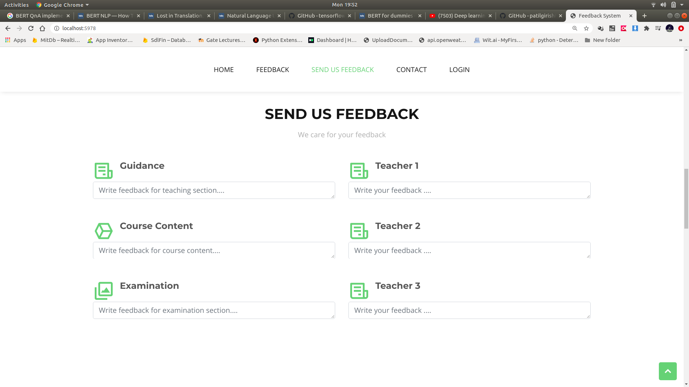
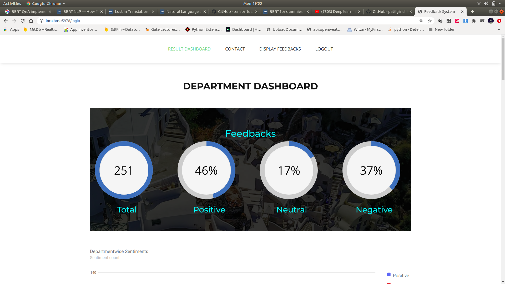
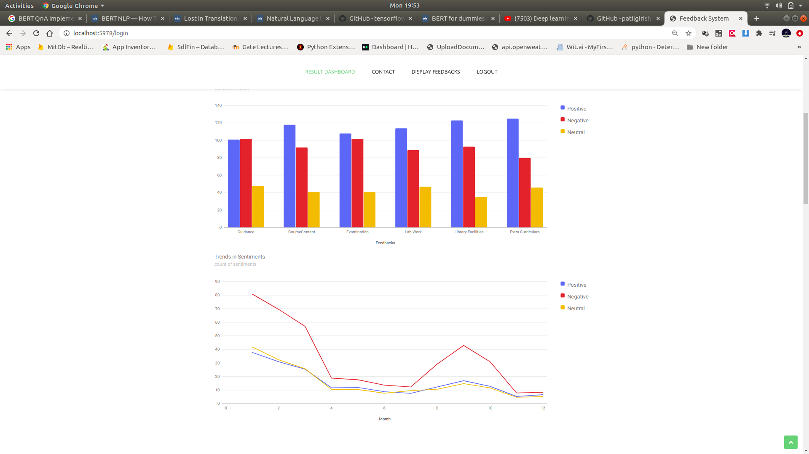
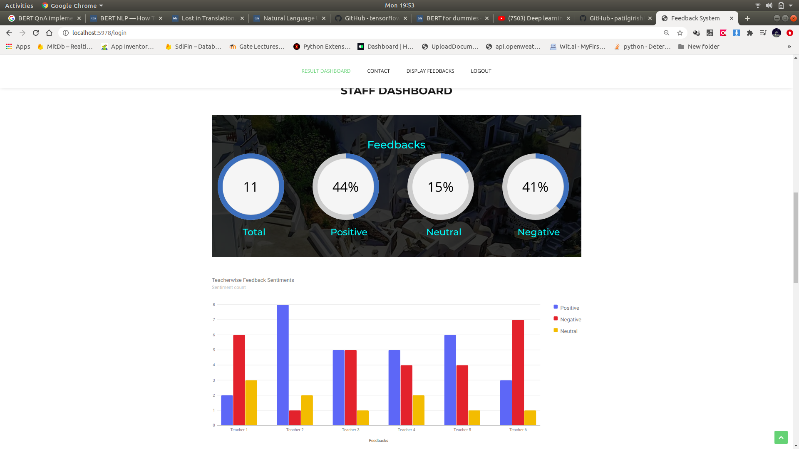
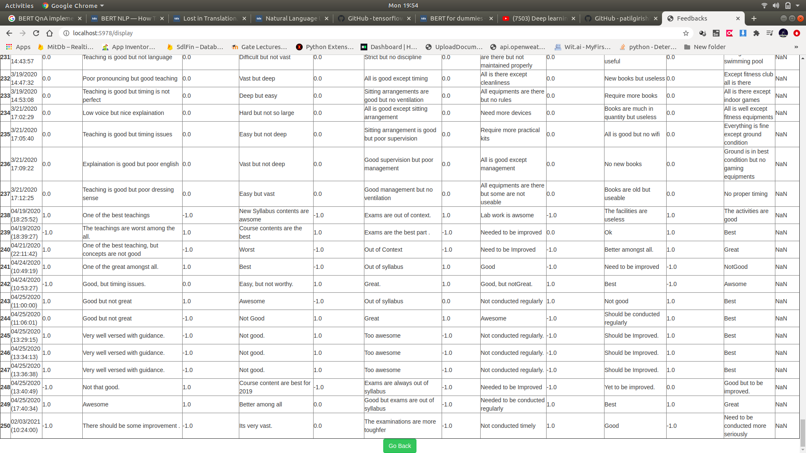

# Student Feedback & Dashboard System Using Sentiment Analysis #

The goal of this project is to develop an automated robust feedback analysis system wherein the user has to write the feedback in application for departments and teachers, then we process and extract the data with the help of NLTK and then apply sentiment analysis using various machine learning algorithm and selecting best algorithm to extract the opinions and subjectivity from the student feedback by classifying them into 3 different categories :

- Positive (1)
- Neutral (0)
- Negative (-1)

.png "Screenshot of Login Page")

## Feedback Form ##

## Department Feedback Dashboard ##

## Staff Feedback Dashboard ##

## Some Classified Sentiments ##

